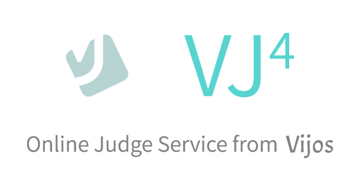

[](https://greenkeeper.io/)
[](https://travis-ci.org/vijos/vj4)
[](https://codeclimate.com/github/vijos/vj4)
[](https://www.versioneye.com/user/projects/575c163d7757a0004a1ded62)
[](https://raw.githubusercontent.com/vijos/vj4/master/LICENSE)

Next generation of [Vijos](https://vijos.org), built with asyncio on Python 3.5.

## Overview

- Problem Categories and Tags
- Solution Sharing & Voting
- Online Coding and Testing (a.k.a. Scratchpad Mode)
- Discussions & Comments
- Trainings
- Contests (ACM & OI)
- Dynamic Ranking System
- Real-time Status Updates
- Online Judge as a Service (a.k.a. Domain): create your own OJ website without dev-ops!
- Management UI
- Sandboxed & Distributed Judging: see [jd4](https://github.com/vijos/jd4), [winjudge](https://github.com/iceb0y/winjudge) and [windows-container](https://github.com/iceb0y/windows-container)
- Secure (we are also CTF players)
- Modern Architecture & User Interface

## Prerequisites

* [Python 3.5+](https://www.python.org/downloads/)
* [MongoDB 3.0+](https://docs.mongodb.org/manual/installation/)
* [Node.js 4.0+](https://nodejs.org/en/download/)
* [RabbitMQ](http://www.rabbitmq.com/)

## Install requirements

In the root of the repository, where `requirements.txt` and `package.json` locates:

```bash
python3 -m pip install -r requirements.txt
npm install   # cnpm install
```

You don't need root privilege to run `npm install`. It installs stuffs in the project directory.

You may want to use [cnpm](https://npm.taobao.org/) and [tuna](https://pypi.tuna.tsinghua.edu.cn/)
if you are in China. Make sure to use `cnpm` by adding `alias` to `npm` instead of installing cnpm cli-tool.

Some requirements may need `Python.h`. In Ubuntu/Debian simply use

```bash
apt install python3-dev
```

to resolve the problem.

### IP Geo-Location

To enable IP geo-location translation, you need to obtain a [MaxMind GeoLite City DB](http://dev.maxmind.com/geoip/geoip2/geolite2/) and put it in the project root directory:

```bash
curl "http://geolite.maxmind.com/download/geoip/database/GeoLite2-City.mmdb.gz" | gunzip -c > GeoLite2-City.mmdb
```

You may also want to install [libmaxminddb](https://github.com/maxmind/libmaxminddb/blob/master/README.md) for higher performance.

## Development

In the root of the repository:

```bash
npm run build   # or: npm run build:watch
python3 -m vj4.server --debug
```

> Set `--listen` (default: http://127.0.0.1:8888) to listen on a different address.

As an intuitive example, you may want to add a super administator and a problem to start:

```bash
alias pm="python3 -m"
pm vj4.model.user add -1 icebox 12345 icebox@iceboy.org
pm vj4.model.user set_superadmin -1
pm vj4.model.adaptor.problem add system "Dummy Problem" "# It *works*" -1 1000   # you can also use web UI
```

You need to run these scripts on a regular basis to maintain correct RP and ranks for all users:

```bash
pm vj4.job.rp recalc_all
pm vj4.job.rank run_all
```

### Watch and Restart

Frontend source codes can be recompiled automatically by running:

```bash
npm run build:watch
```

However you need to manually restart the server for server-side code to take effect.

## Production

```bash
npm run build:production
python3 -m vj4.server --listen=unix:/var/run/vj4.sock
```

* Set `--listen` (default: http://127.0.0.1:8888) to listen on a different address.
* Set `--prefork` (default: 1) to specify the number of worker processes.
* Set `--ip-header` (default: X-Forwarded-For) to use IP address in request headers.
* Set `--url-prefix` (default: https://vijos.org) to set URL prefix.
* Set `--cdn-prefix` (default: /) to set CDN prefix.
* Set `--smtp-host`, `--smtp-user` and `--smtp-password` to specify a SMTP server.
* Set `--db-host` (default: localhost) and/or `--db-name` (default: test) to use a different
  database.

Better to use a reverse proxy like Nginx or h2o.

## Notes

Have fun!

Maximum line width: 100

Indentation: 2 spaces

[JavaScript Style Guide](https://github.com/airbnb/javascript)

## References

* [aiohttp](http://aiohttp.readthedocs.org/en/stable/)
* [Jinja2 Documentation](http://jinja.pocoo.org/docs/)
* [Motor: Asynchronous Python driver for MongoDB](http://motor.readthedocs.org/en/stable/)
* [Webpack Module Bundler](https://webpack.js.org/)
